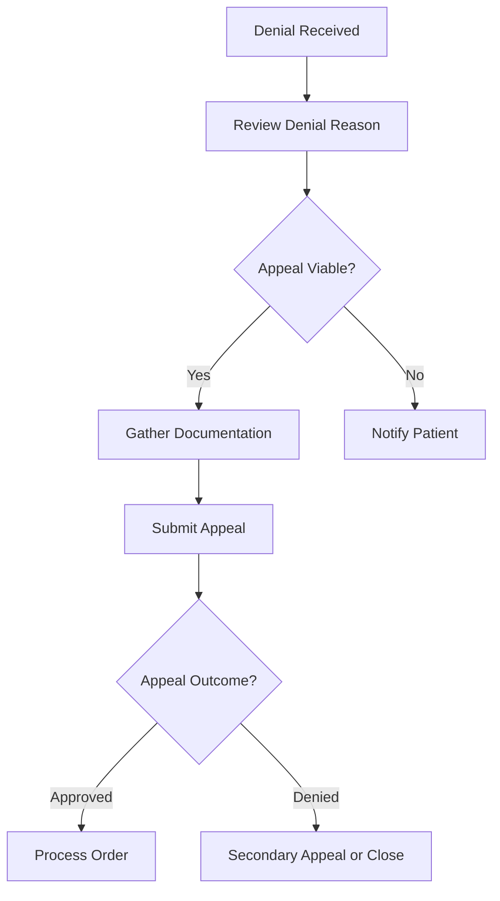

# Coverage Appeal

Process for appealing denied insurance coverage.

```mermaid
flowchart TD
    A[Denial Received] --> B[Review Denial Reason]
    B --> C{Appeal Viable?}
    C -->|Yes| D[Gather Documentation]
    C -->|No| E[Notify Patient]
    D --> F[Submit Appeal]
    F --> G{Appeal Outcome?}
    G -->|Approved| H[Process Order]
    G -->|Denied| I[Secondary Appeal or Close]
```
