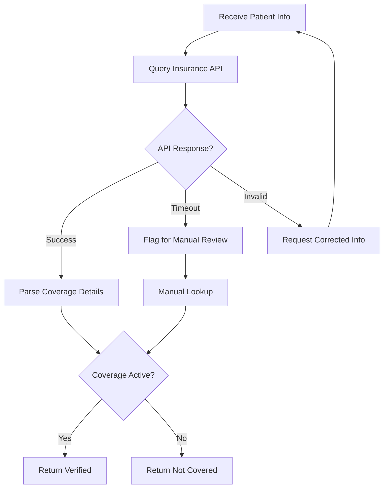

# Insurance Verification

Verifies patient insurance coverage via API, with manual fallback for timeouts or errors.

```mermaid
flowchart TD
    A[Receive Patient Info] --> B[Query Insurance API]
    B --> C{API Response?}
    C -->|Success| D[Parse Coverage Details]
    C -->|Timeout| E[Flag for Manual Review]
    C -->|Invalid| F[Request Corrected Info]
    F --> A
    D --> G{Coverage Active?}
    G -->|Yes| H[Return Verified]
    G -->|No| I[Return Not Covered]
    E --> J[Manual Lookup]
    J --> G
```
