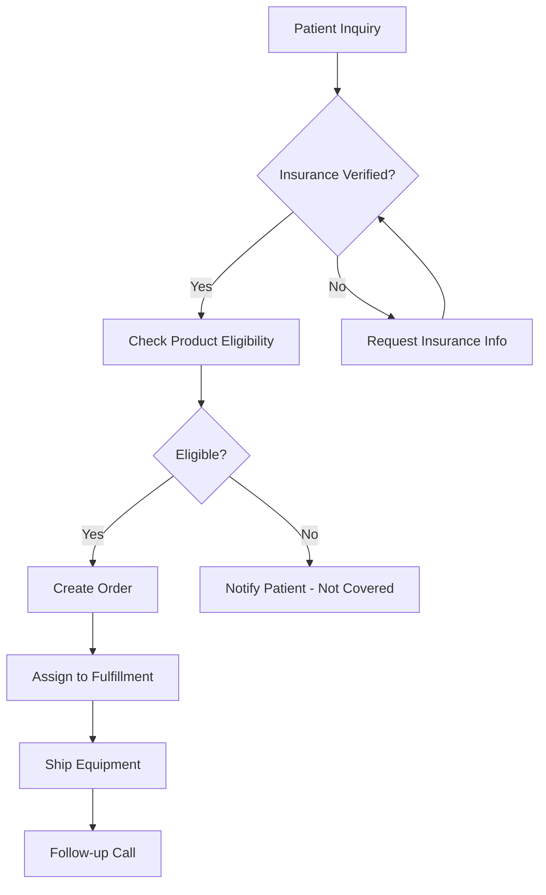

# Patient Equipment Order

End-to-end flow from patient inquiry through insurance verification, order creation, and fulfillment.

```mermaid
flowchart TD
    A[Patient Inquiry] --> B{Insurance Verified?}
    B -->|Yes| C[Check Product Eligibility]
    B -->|No| D[Request Insurance Info]
    D --> B
    C --> E{Eligible?}
    E -->|Yes| F[Create Order]
    E -->|No| G[Notify Patient - Not Covered]
    F --> H[Assign to Fulfillment]
    H --> I[Ship Equipment]
    I --> J[Follow-up Call]
```
