# Returns & Exchange

Handling equipment returns and exchanges.

```mermaid
flowchart TD
    A[Return Request Received] --> B{Request Source?}
    B -->|Phone| C[Log Call Details]
    B -->|Web Portal| D[Validate Portal Session]
    B -->|Email| E[Parse Email Content]
    B -->|In-Person| F[Scan Equipment Barcode]

    C --> G[Pull Customer Record]
    D --> G
    E --> G
    F --> G

    G --> H{Customer Found?}
    H -->|No| I[Search by Equipment Serial]
    H -->|Yes| J[Verify Purchase History]
    I --> K{Equipment Found?}
    K -->|No| L[Escalate to Supervisor]
    K -->|Yes| M[Link to Original Order]
    M --> J

    J --> N{Within Return Window?}
    N -->|Yes - Standard| O[Standard Return Process]
    N -->|Yes - Extended Warranty| P[Warranty Return Process]
    N -->|No| Q{Exception Review}

    Q --> R{Exception Type?}
    R -->|Medical Necessity| S[Request Doctor Note]
    R -->|Product Defect| T[Initiate QA Review]
    R -->|Customer Loyalty| U[Check Account Standing]
    R -->|Other| V[Manager Approval Required]

    S --> W{Documentation Valid?}
    W -->|Yes| O
    W -->|No| X[Deny Return - Document Reason]

    T --> Y[QA Inspection Queue]
    Y --> Z{Defect Confirmed?}
    Z -->|Yes| AA[Full Refund + Replacement]
    Z -->|No| AB[Standard Policy Applies]
    AB --> Q

    U --> AC{Account Score?}
    AC -->|Platinum| O
    AC -->|Gold| AD[Partial Credit Offered]
    AC -->|Standard| X

    V --> AE{Manager Decision?}
    AE -->|Approve| O
    AE -->|Deny| X
    AE -->|Escalate| AF[Director Review]
    AF --> AG{Director Decision?}
    AG -->|Approve| O
    AG -->|Deny| X

    O --> AH[Generate RMA Number]
    P --> AH

    AH --> AI{Return Method?}
    AI -->|Ship Back| AJ[Generate Prepaid Label]
    AI -->|Drop Off| AK[Locate Nearest Facility]
    AI -->|Pickup| AL[Schedule Courier]

    AJ --> AM[Email Label to Customer]
    AK --> AN[Send Location Details]
    AL --> AO[Confirm Pickup Window]

    AM --> AP[Await Equipment Receipt]
    AN --> AP
    AO --> AP

    AP --> AQ[Equipment Received]
    AQ --> AR[Log Receipt in System]
    AR --> AS[Initial Visual Inspection]

    AS --> AT{Packaging Intact?}
    AT -->|No| AU[Document Damage - Photo]
    AT -->|Yes| AV[Proceed to Detailed Inspection]
    AU --> AV

    AV --> AW{Equipment Condition?}
    AW -->|Like New| AX[Full Credit Processing]
    AW -->|Minor Wear| AY[Standard Credit Processing]
    AW -->|Damaged| AZ[Damage Assessment]
    AW -->|Missing Parts| BA[Parts Inventory Check]

    AZ --> BB{Damage Cause?}
    BB -->|Shipping| BC[File Carrier Claim]
    BB -->|Customer| BD[Calculate Restocking Fee]
    BB -->|Manufacturing| AA

    BC --> BE[Carrier Claim Process]
    BE --> BF{Claim Outcome?}
    BF -->|Approved| AX
    BF -->|Denied| BD

    BD --> BG[Apply Fee to Credit]
    BG --> AY

    BA --> BH{Parts Available?}
    BH -->|Yes| BI[Deduct Parts Cost]
    BH -->|No| BJ[Extended Assessment]
    BI --> AY
    BJ --> AZ

    AX --> BK[Process Full Refund]
    AY --> BL[Process Adjusted Credit]
    AD --> BL

    BK --> BM{Original Payment Method?}
    BL --> BM

    BM -->|Credit Card| BN[Initiate Card Refund]
    BM -->|Insurance| BO[Submit Insurance Reversal]
    BM -->|Check| BP[Issue Refund Check]
    BM -->|Store Credit| BQ[Add to Account Balance]

    BN --> BR[Refund Confirmation]
    BO --> BS[Insurance Processing Queue]
    BP --> BT[Mail Check - Track Delivery]
    BQ --> BR

    BS --> BU{Insurance Approved?}
    BU -->|Yes| BR
    BU -->|No| BV[Patient Responsibility Notice]
    BV --> BM

    BT --> BR

    BR --> BW[Update Inventory System]
    BW --> BX{Equipment Disposition?}
    BX -->|Resell| BY[Refurbishment Queue]
    BX -->|Donate| BZ[Charity Coordination]
    BX -->|Recycle| CA[E-Waste Processing]
    BX -->|Destroy| CB[Destruction Certificate]

    BY --> CC[Refurb Complete]
    CC --> CD[Return to Inventory]

    BZ --> CE[Donation Receipt]
    CA --> CF[Recycling Confirmation]
    CB --> CG[Destruction Log]

    CD --> CH[Close Return Case]
    CE --> CH
    CF --> CH
    CG --> CH

    CH --> CI[Customer Satisfaction Survey]
    CI --> CJ[Archive Case]

    X --> CK[Denial Letter Generated]
    CK --> CL{Appeal Requested?}
    CL -->|Yes| AF
    CL -->|No| CJ

    L --> CM[Supervisor Review]
    CM --> CN{Resolution?}
    CN -->|Found Record| G
    CN -->|No Record| CO[Manual Case Creation]
    CO --> J
```

[Open in Mermaid Live →](https://mermaid.live/edit#base64:eyJjb2RlIjogImZsb3djaGFydCBURFxuICAgIEFbUmV0dXJuIFJlcXVlc3QgUmVjZWl2ZWRdIC0tPiBCe1JlcXVlc3QgU291cmNlP31cbiAgICBCIC0tPnxQaG9uZXwgQ1tMb2cgQ2FsbCBEZXRhaWxzXVxuICAgIEIgLS0-fFdlYiBQb3J0YWx8IERbVmFsaWRhdGUgUG9ydGFsIFNlc3Npb25dXG4gICAgQiAtLT58RW1haWx8IEVbUGFyc2UgRW1haWwgQ29udGVudF1cbiAgICBCIC0tPnxJbi1QZXJzb258IEZbU2NhbiBFcXVpcG1lbnQgQmFyY29kZV1cblxuICAgIEMgLS0-IEdbUHVsbCBDdXN0b21lciBSZWNvcmRdXG4gICAgRCAtLT4gR1xuICAgIEUgLS0-IEdcbiAgICBGIC0tPiBHXG5cbiAgICBHIC0tPiBIe0N1c3RvbWVyIEZvdW5kP31cbiAgICBIIC0tPnxOb3wgSVtTZWFyY2ggYnkgRXF1aXBtZW50IFNlcmlhbF1cbiAgICBIIC0tPnxZZXN8IEpbVmVyaWZ5IFB1cmNoYXNlIEhpc3RvcnldXG4gICAgSSAtLT4gS3tFcXVpcG1lbnQgRm91bmQ_fVxuICAgIEsgLS0-fE5vfCBMW0VzY2FsYXRlIHRvIFN1cGVydmlzb3JdXG4gICAgSyAtLT58WWVzfCBNW0xpbmsgdG8gT3JpZ2luYWwgT3JkZXJdXG4gICAgTSAtLT4gSlxuXG4gICAgSiAtLT4gTntXaXRoaW4gUmV0dXJuIFdpbmRvdz99XG4gICAgTiAtLT58WWVzIC0gU3RhbmRhcmR8IE9bU3RhbmRhcmQgUmV0dXJuIFByb2Nlc3NdXG4gICAgTiAtLT58WWVzIC0gRXh0ZW5kZWQgV2FycmFudHl8IFBbV2FycmFudHkgUmV0dXJuIFByb2Nlc3NdXG4gICAgTiAtLT58Tm98IFF7RXhjZXB0aW9uIFJldmlld31cblxuICAgIFEgLS0-IFJ7RXhjZXB0aW9uIFR5cGU_fVxuICAgIFIgLS0-fE1lZGljYWwgTmVjZXNzaXR5fCBTW1JlcXVlc3QgRG9jdG9yIE5vdGVdXG4gICAgUiAtLT58UHJvZHVjdCBEZWZlY3R8IFRbSW5pdGlhdGUgUUEgUmV2aWV3XVxuICAgIFIgLS0-fEN1c3RvbWVyIExveWFsdHl8IFVbQ2hlY2sgQWNjb3VudCBTdGFuZGluZ11cbiAgICBSIC0tPnxPdGhlcnwgVltNYW5hZ2VyIEFwcHJvdmFsIFJlcXVpcmVkXVxuXG4gICAgUyAtLT4gV3tEb2N1bWVudGF0aW9uIFZhbGlkP31cbiAgICBXIC0tPnxZZXN8IE9cbiAgICBXIC0tPnxOb3wgWFtEZW55IFJldHVybiAtIERvY3VtZW50IFJlYXNvbl1cblxuICAgIFQgLS0-IFlbUUEgSW5zcGVjdGlvbiBRdWV1ZV1cbiAgICBZIC0tPiBae0RlZmVjdCBDb25maXJtZWQ_fVxuICAgIFogLS0-fFllc3wgQUFbRnVsbCBSZWZ1bmQgKyBSZXBsYWNlbWVudF1cbiAgICBaIC0tPnxOb3wgQUJbU3RhbmRhcmQgUG9saWN5IEFwcGxpZXNdXG4gICAgQUIgLS0-IFFcblxuICAgIFUgLS0-IEFDe0FjY291bnQgU2NvcmU_fVxuICAgIEFDIC0tPnxQbGF0aW51bXwgT1xuICAgIEFDIC0tPnxHb2xkfCBBRFtQYXJ0aWFsIENyZWRpdCBPZmZlcmVkXVxuICAgIEFDIC0tPnxTdGFuZGFyZHwgWFxuXG4gICAgViAtLT4gQUV7TWFuYWdlciBEZWNpc2lvbj99XG4gICAgQUUgLS0-fEFwcHJvdmV8IE9cbiAgICBBRSAtLT58RGVueXwgWFxuICAgIEFFIC0tPnxFc2NhbGF0ZXwgQUZbRGlyZWN0b3IgUmV2aWV3XVxuICAgIEFGIC0tPiBBR3tEaXJlY3RvciBEZWNpc2lvbj99XG4gICAgQUcgLS0-fEFwcHJvdmV8IE9cbiAgICBBRyAtLT58RGVueXwgWFxuXG4gICAgTyAtLT4gQUhbR2VuZXJhdGUgUk1BIE51bWJlcl1cbiAgICBQIC0tPiBBSFxuXG4gICAgQUggLS0-IEFJe1JldHVybiBNZXRob2Q_fVxuICAgIEFJIC0tPnxTaGlwIEJhY2t8IEFKW0dlbmVyYXRlIFByZXBhaWQgTGFiZWxdXG4gICAgQUkgLS0-fERyb3AgT2ZmfCBBS1tMb2NhdGUgTmVhcmVzdCBGYWNpbGl0eV1cbiAgICBBSSAtLT58UGlja3VwfCBBTFtTY2hlZHVsZSBDb3VyaWVyXVxuXG4gICAgQUogLS0-IEFNW0VtYWlsIExhYmVsIHRvIEN1c3RvbWVyXVxuICAgIEFLIC0tPiBBTltTZW5kIExvY2F0aW9uIERldGFpbHNdXG4gICAgQUwgLS0-IEFPW0NvbmZpcm0gUGlja3VwIFdpbmRvd11cblxuICAgIEFNIC0tPiBBUFtBd2FpdCBFcXVpcG1lbnQgUmVjZWlwdF1cbiAgICBBTiAtLT4gQVBcbiAgICBBTyAtLT4gQVBcblxuICAgIEFQIC0tPiBBUVtFcXVpcG1lbnQgUmVjZWl2ZWRdXG4gICAgQVEgLS0-IEFSW0xvZyBSZWNlaXB0IGluIFN5c3RlbV1cbiAgICBBUiAtLT4gQVNbSW5pdGlhbCBWaXN1YWwgSW5zcGVjdGlvbl1cblxuICAgIEFTIC0tPiBBVHtQYWNrYWdpbmcgSW50YWN0P31cbiAgICBBVCAtLT58Tm98IEFVW0RvY3VtZW50IERhbWFnZSAtIFBob3RvXVxuICAgIEFUIC0tPnxZZXN8IEFWW1Byb2NlZWQgdG8gRGV0YWlsZWQgSW5zcGVjdGlvbl1cbiAgICBBVSAtLT4gQVZcblxuICAgIEFWIC0tPiBBV3tFcXVpcG1lbnQgQ29uZGl0aW9uP31cbiAgICBBVyAtLT58TGlrZSBOZXd8IEFYW0Z1bGwgQ3JlZGl0IFByb2Nlc3NpbmddXG4gICAgQVcgLS0-fE1pbm9yIFdlYXJ8IEFZW1N0YW5kYXJkIENyZWRpdCBQcm9jZXNzaW5nXVxuICAgIEFXIC0tPnxEYW1hZ2VkfCBBWltEYW1hZ2UgQXNzZXNzbWVudF1cbiAgICBBVyAtLT58TWlzc2luZyBQYXJ0c3wgQkFbUGFydHMgSW52ZW50b3J5IENoZWNrXVxuXG4gICAgQVogLS0-IEJCe0RhbWFnZSBDYXVzZT99XG4gICAgQkIgLS0-fFNoaXBwaW5nfCBCQ1tGaWxlIENhcnJpZXIgQ2xhaW1dXG4gICAgQkIgLS0-fEN1c3RvbWVyfCBCRFtDYWxjdWxhdGUgUmVzdG9ja2luZyBGZWVdXG4gICAgQkIgLS0-fE1hbnVmYWN0dXJpbmd8IEFBXG5cbiAgICBCQyAtLT4gQkVbQ2FycmllciBDbGFpbSBQcm9jZXNzXVxuICAgIEJFIC0tPiBCRntDbGFpbSBPdXRjb21lP31cbiAgICBCRiAtLT58QXBwcm92ZWR8IEFYXG4gICAgQkYgLS0-fERlbmllZHwgQkRcblxuICAgIEJEIC0tPiBCR1tBcHBseSBGZWUgdG8gQ3JlZGl0XVxuICAgIEJHIC0tPiBBWVxuXG4gICAgQkEgLS0-IEJIe1BhcnRzIEF2YWlsYWJsZT99XG4gICAgQkggLS0-fFllc3wgQklbRGVkdWN0IFBhcnRzIENvc3RdXG4gICAgQkggLS0-fE5vfCBCSltFeHRlbmRlZCBBc3Nlc3NtZW50XVxuICAgIEJJIC0tPiBBWVxuICAgIEJKIC0tPiBBWlxuXG4gICAgQVggLS0-IEJLW1Byb2Nlc3MgRnVsbCBSZWZ1bmRdXG4gICAgQVkgLS0-IEJMW1Byb2Nlc3MgQWRqdXN0ZWQgQ3JlZGl0XVxuICAgIEFEIC0tPiBCTFxuXG4gICAgQksgLS0-IEJNe09yaWdpbmFsIFBheW1lbnQgTWV0aG9kP31cbiAgICBCTCAtLT4gQk1cblxuICAgIEJNIC0tPnxDcmVkaXQgQ2FyZHwgQk5bSW5pdGlhdGUgQ2FyZCBSZWZ1bmRdXG4gICAgQk0gLS0-fEluc3VyYW5jZXwgQk9bU3VibWl0IEluc3VyYW5jZSBSZXZlcnNhbF1cbiAgICBCTSAtLT58Q2hlY2t8IEJQW0lzc3VlIFJlZnVuZCBDaGVja11cbiAgICBCTSAtLT58U3RvcmUgQ3JlZGl0fCBCUVtBZGQgdG8gQWNjb3VudCBCYWxhbmNlXVxuXG4gICAgQk4gLS0-IEJSW1JlZnVuZCBDb25maXJtYXRpb25dXG4gICAgQk8gLS0-IEJTW0luc3VyYW5jZSBQcm9jZXNzaW5nIFF1ZXVlXVxuICAgIEJQIC0tPiBCVFtNYWlsIENoZWNrIC0gVHJhY2sgRGVsaXZlcnldXG4gICAgQlEgLS0-IEJSXG5cbiAgICBCUyAtLT4gQlV7SW5zdXJhbmNlIEFwcHJvdmVkP31cbiAgICBCVSAtLT58WWVzfCBCUlxuICAgIEJVIC0tPnxOb3wgQlZbUGF0aWVudCBSZXNwb25zaWJpbGl0eSBOb3RpY2VdXG4gICAgQlYgLS0-IEJNXG5cbiAgICBCVCAtLT4gQlJcblxuICAgIEJSIC0tPiBCV1tVcGRhdGUgSW52ZW50b3J5IFN5c3RlbV1cbiAgICBCVyAtLT4gQlh7RXF1aXBtZW50IERpc3Bvc2l0aW9uP31cbiAgICBCWCAtLT58UmVzZWxsfCBCWVtSZWZ1cmJpc2htZW50IFF1ZXVlXVxuICAgIEJYIC0tPnxEb25hdGV8IEJaW0NoYXJpdHkgQ29vcmRpbmF0aW9uXVxuICAgIEJYIC0tPnxSZWN5Y2xlfCBDQVtFLVdhc3RlIFByb2Nlc3NpbmddXG4gICAgQlggLS0-fERlc3Ryb3l8IENCW0Rlc3RydWN0aW9uIENlcnRpZmljYXRlXVxuXG4gICAgQlkgLS0-IENDW1JlZnVyYiBDb21wbGV0ZV1cbiAgICBDQyAtLT4gQ0RbUmV0dXJuIHRvIEludmVudG9yeV1cblxuICAgIEJaIC0tPiBDRVtEb25hdGlvbiBSZWNlaXB0XVxuICAgIENBIC0tPiBDRltSZWN5Y2xpbmcgQ29uZmlybWF0aW9uXVxuICAgIENCIC0tPiBDR1tEZXN0cnVjdGlvbiBMb2ddXG5cbiAgICBDRCAtLT4gQ0hbQ2xvc2UgUmV0dXJuIENhc2VdXG4gICAgQ0UgLS0-IENIXG4gICAgQ0YgLS0-IENIXG4gICAgQ0cgLS0-IENIXG5cbiAgICBDSCAtLT4gQ0lbQ3VzdG9tZXIgU2F0aXNmYWN0aW9uIFN1cnZleV1cbiAgICBDSSAtLT4gQ0pbQXJjaGl2ZSBDYXNlXVxuXG4gICAgWCAtLT4gQ0tbRGVuaWFsIExldHRlciBHZW5lcmF0ZWRdXG4gICAgQ0sgLS0-IENMe0FwcGVhbCBSZXF1ZXN0ZWQ_fVxuICAgIENMIC0tPnxZZXN8IEFGXG4gICAgQ0wgLS0-fE5vfCBDSlxuXG4gICAgTCAtLT4gQ01bU3VwZXJ2aXNvciBSZXZpZXddXG4gICAgQ00gLS0-IENOe1Jlc29sdXRpb24_fVxuICAgIENOIC0tPnxGb3VuZCBSZWNvcmR8IEdcbiAgICBDTiAtLT58Tm8gUmVjb3JkfCBDT1tNYW51YWwgQ2FzZSBDcmVhdGlvbl1cbiAgICBDTyAtLT4gSiIsICJtZXJtYWlkIjogInt9IiwgImF1dG9TeW5jIjogdHJ1ZSwgInVwZGF0ZURpYWdyYW0iOiB0cnVlfQ==)

