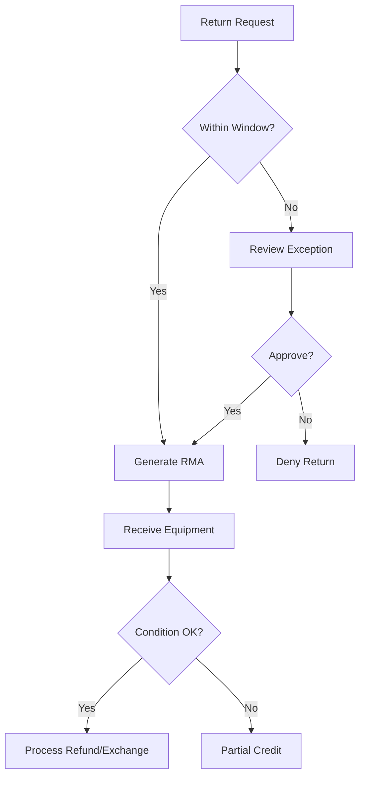

# Returns & Exchange

Handling equipment returns and exchanges.

```mermaid
flowchart TD
    A[Return Request] --> B{Within Window?}
    B -->|Yes| C[Generate RMA]
    B -->|No| D[Review Exception]
    D --> E{Approve?}
    E -->|Yes| C
    E -->|No| F[Deny Return]
    C --> G[Receive Equipment]
    G --> H{Condition OK?}
    H -->|Yes| I[Process Refund/Exchange]
    H -->|No| J[Partial Credit]
```
