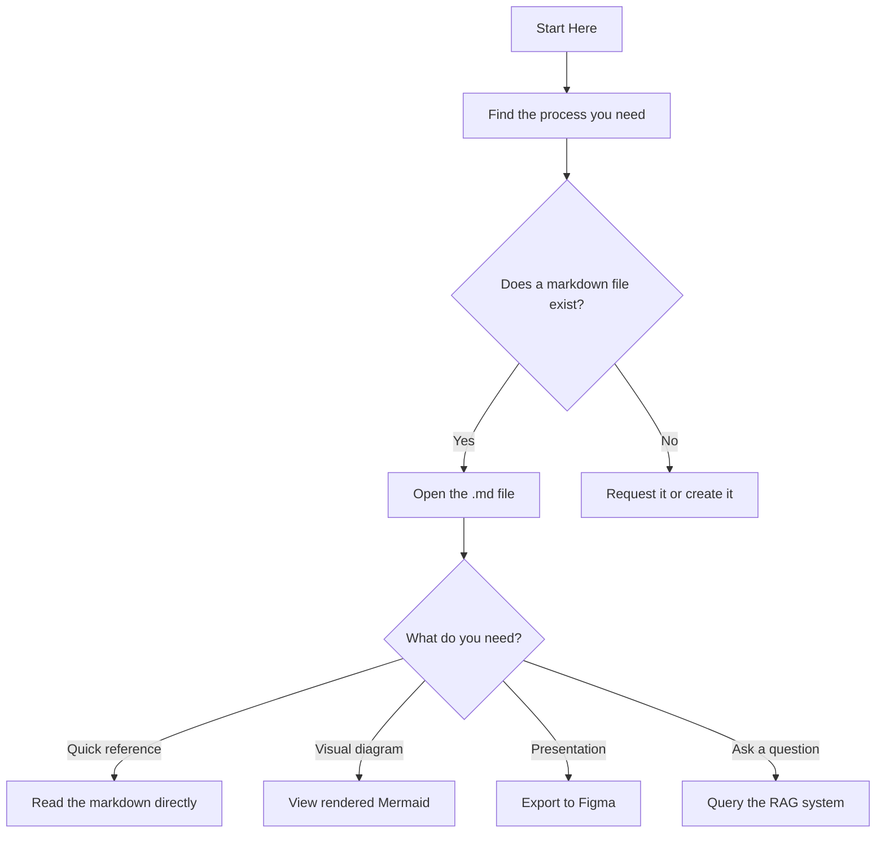

# Process Flows

Source of truth for how things work. Markdown files in, multiple outputs out.

## Quick start

1. Go to `/flows/`
2. Find your process
3. Read the markdown, or paste the Mermaid block into [mermaid.live](https://mermaid.live) to see the diagram

## Adding or updating a flow

Edit the markdown in `/flows/`. That's it. Everything else derives from there.

## Questions?

Ask Jack, Alex or check the RAG system.