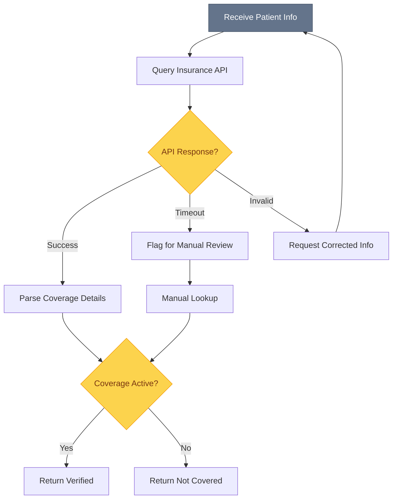

# Insurance Verification

```mermaid
flowchart TD
    A[Receive Patient Info]:::startEnd --> B[Query Insurance API]
    B --> C{API Response?}:::decision
    C -->|Success| D[Parse Coverage Details]
    C -->|Timeout| E[Flag for Manual Review]
    C -->|Invalid| F[Request Corrected Info]
    F --> A
    D --> G{Coverage Active?}:::decision
    G -->|Yes| H[Return Verified]
    G -->|No| I[Return Not Covered]
    E --> J[Manual Lookup]
    J --> G

    classDef startEnd fill:#64748B,color:#FFFFFF,stroke:#475569
    classDef step fill:#DBEAFE,color:#1E40AF,stroke:#93C5FD
    classDef decision fill:#FCD34D,color:#78350F,stroke:#F59E0B
    classDef action fill:#3B82F6,color:#FFFFFF,stroke:#2563EB
    classDef error fill:#F87171,color:#7F1D1D,stroke:#EF4444
```
