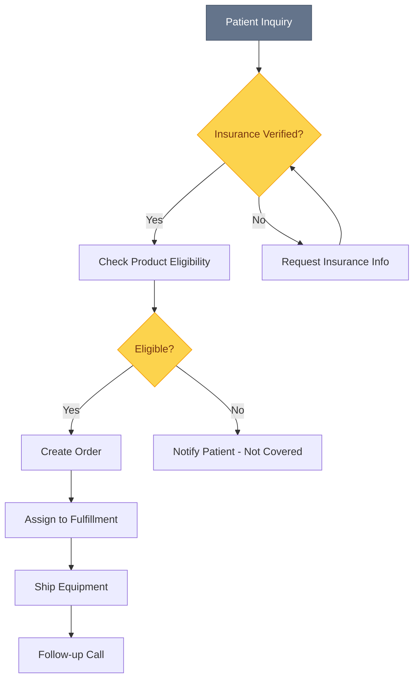

# Patient Equipment Order Flow

```mermaid
flowchart TD
    A[Patient Inquiry]:::startEnd --> B{Insurance Verified?}:::decision
    B -->|Yes| C[Check Product Eligibility]
    B -->|No| D[Request Insurance Info]
    D --> B
    C --> E{Eligible?}:::decision
    E -->|Yes| F[Create Order]
    E -->|No| G[Notify Patient - Not Covered]
    F --> H[Assign to Fulfillment]
    H --> I[Ship Equipment]
    I --> J[Follow-up Call]

    classDef startEnd fill:#64748B,color:#FFFFFF,stroke:#475569
    classDef step fill:#DBEAFE,color:#1E40AF,stroke:#93C5FD
    classDef decision fill:#FCD34D,color:#78350F,stroke:#F59E0B
    classDef action fill:#3B82F6,color:#FFFFFF,stroke:#2563EB
    classDef error fill:#F87171,color:#7F1D1D,stroke:#EF4444
```
